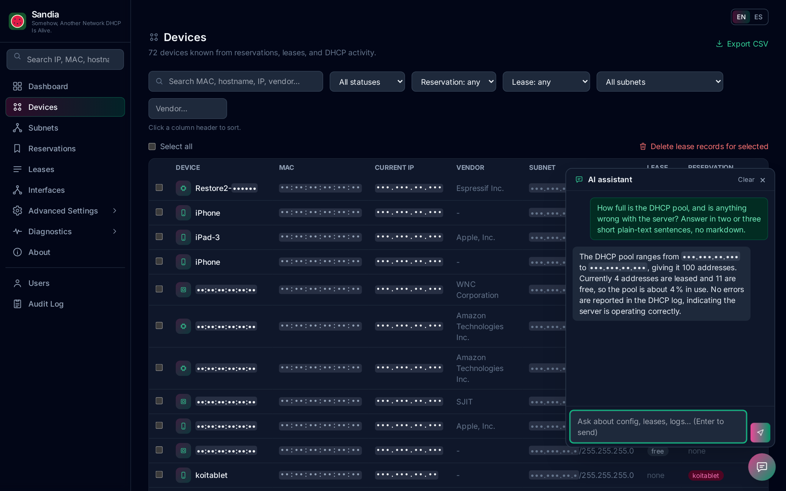
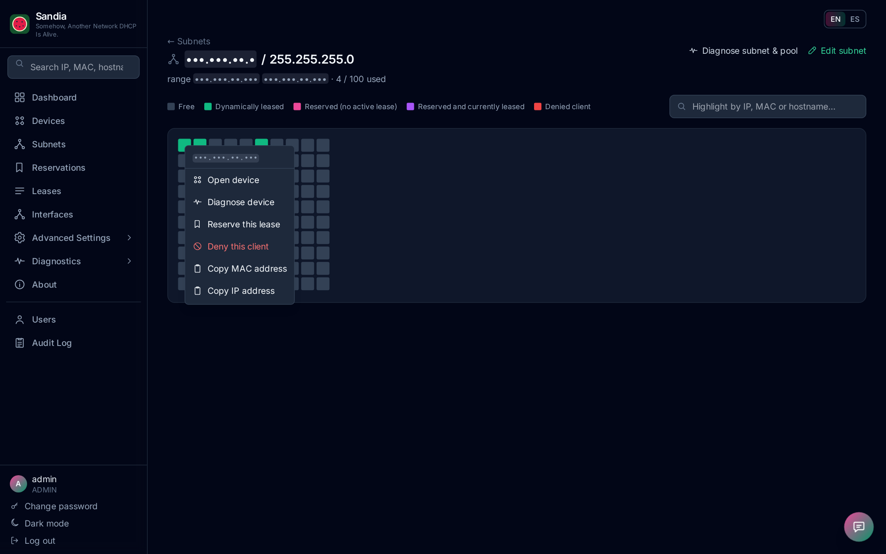
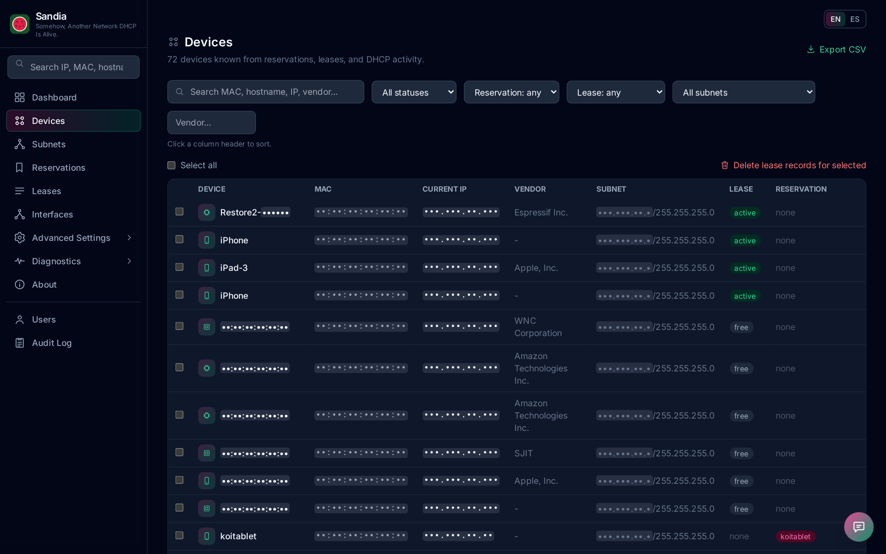
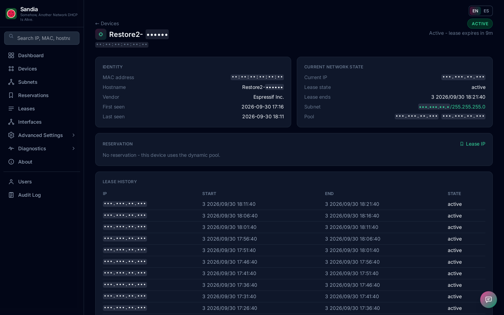
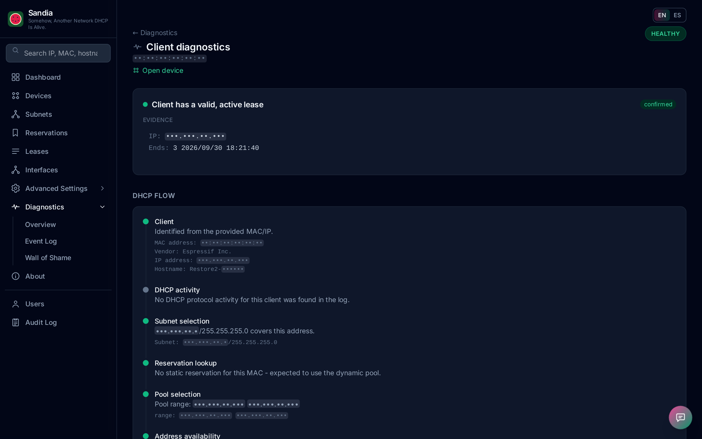
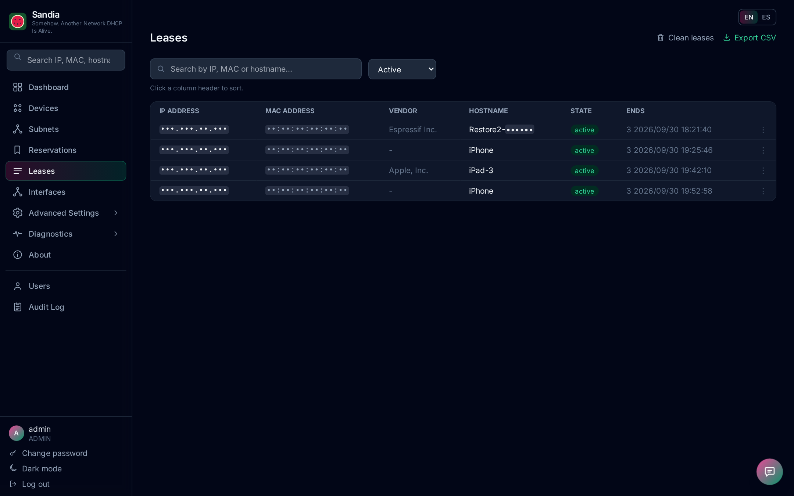
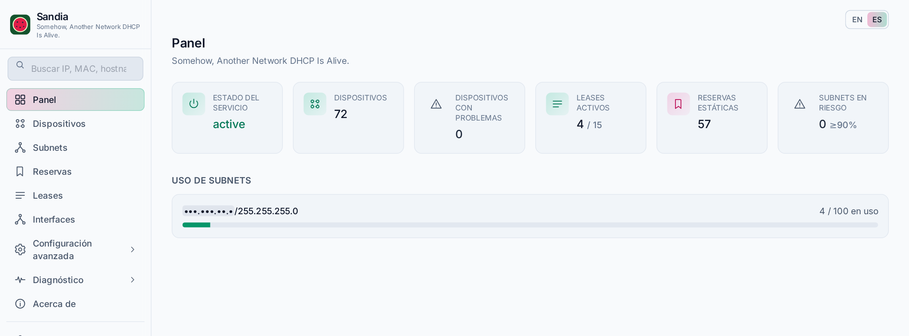
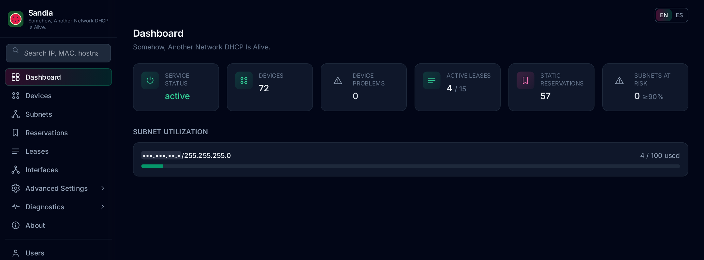

<div align="center">


# Sandia

**S**omehow, **A**nother **N**etwork **D**HCP **I**s **A**live.

A modern web console for **ISC isc-dhcp-server**: see every device, every lease and every address at a glance, find out *why* a client didn't get an IP, and change the config without ever taking the server down.

[](https://github.com/moralesaugusto/sandia/releases)
[](pyproject.toml)
[](https://fastapi.tiangolo.com)
[](LICENSE)
[](docs/PROJECT_VISION.md)



</div>

---

*Sandia* is Spanish for watermelon, and the logo and colors run with it. Under the rind it is a single, self-hosted Python app that reads the same files dhcpd does (`dhcpd.conf`, `dhcpd.leases`, the DHCP log), so it shows the real state of your network with no agents, no extra database server and no frontend build.

## Highlights

<table>
<tr>
<td width="50%" valign="top">

### See your address space
Every subnet's pool drawn as an SVG grid, one cell per address, colored free / leased / reserved / denied. Right-click any cell to open the device, diagnose it, reserve it or deny it.



</td>
<td width="50%" valign="top">

### Know every device
One row per MAC, correlated from reservations, current leases, full lease history and DHCP activity. Search, filter, sort, bulk-select and export to CSV.



</td>
</tr>
<tr>
<td width="50%" valign="top">

### Device 360
Identity, vendor, current network state, reservation, every IP a MAC has held, and its DHCP activity on one page, linked to the subnet map and diagnostics.



</td>
<td width="50%" valign="top">

### Diagnostics built on evidence
"Why didn't this client get an IP?" Sandia rebuilds the DHCP flow (subnet, reservation, pool, availability, response, lease) from real data and reports one root cause, with its evidence and confidence level. It never presents a guess as a fact.



</td>
</tr>
<tr>
<td width="50%" valign="top">

### Live leases
Active leases with MAC vendor lookup, state filters, sortable columns, CSV export and a right-click menu to reserve or deny a client.



</td>
<td width="50%" valign="top">

### English or Spanish, dark or light
Switch language and theme from any page; the choice is saved on your account. Acronyms and networking terms stay as sysadmins say them.



</td>
</tr>
</table>

<div align="center">

</div>

## What you get

- **Safe config changes.** Every change is staged, validated with `dhcpd -t`, diffed, backed up, installed atomically, then isc-dhcp-server is restarted and checked. If it doesn't come back up, the previous config is restored automatically.
- **Right-click everywhere.** Leases, subnet map cells, reservations and devices all have context menus that offer only the actions that apply to that object.
- **Reservations and subnets** without hand-editing: pool ranges, routers, DNS, NTP, PXE boot options, interface tags, bulk delete, and a raw editor for everything else.
- **AI assistant (optional).** A floating chat window backed by your own local [Ollama](https://ollama.com) server. It answers questions about your config, leases and logs, and it is read-only.
- **DHCP Event Log and Wall of Shame.** Browse parsed dhcpd log events, and see the devices causing the most DHCPNAKs, IP changes and abandoned leases.
- **Built for admins.** Role-based access (admin / operator / viewer), an audit log of every change, login rate limiting, and HTTPS by default with an auto-generated certificate.

## Quick start

Requires Python 3.13+ and [uv](https://docs.astral.sh/uv/).

```bash
git clone https://github.com/moralesaugusto/sandia.git
cd sandia
uv sync
uv run sandia --dummy        # try it with realistic demo data, no root needed
```

Open `https://localhost:7001` and sign in with `admin` / `admin` (change it right away). To manage a real server, run it with enough privilege to edit `/etc/dhcp/dhcpd.conf` and control the service:

```bash
sudo .venv/bin/sandia
```

Setup, configuration (paths, port, HTTPS, log location), and porting to another machine are covered in [INSTRUCTIONS.md](INSTRUCTIONS.md).

## How it's built

FastAPI and Jinja2 on the server, htmx and a little vanilla JavaScript in the browser, Tailwind for styling, SQLite for users and the audit log. There is no SPA framework and no frontend build step. The design choices behind it are in [docs/DECISIONS.md](docs/DECISIONS.md).

```bash
uv run pytest         # 398 tests
uv run ruff check .
```

## Links

- [INSTRUCTIONS.md](INSTRUCTIONS.md): setup, configuration and usage
- [CHANGELOG.md](CHANGELOG.md): release history
- [docs/ROADMAP.md](docs/ROADMAP.md): what's next

Screenshots are from a live installation, with MAC and IP addresses masked.

Released under the [MIT License](LICENSE).
